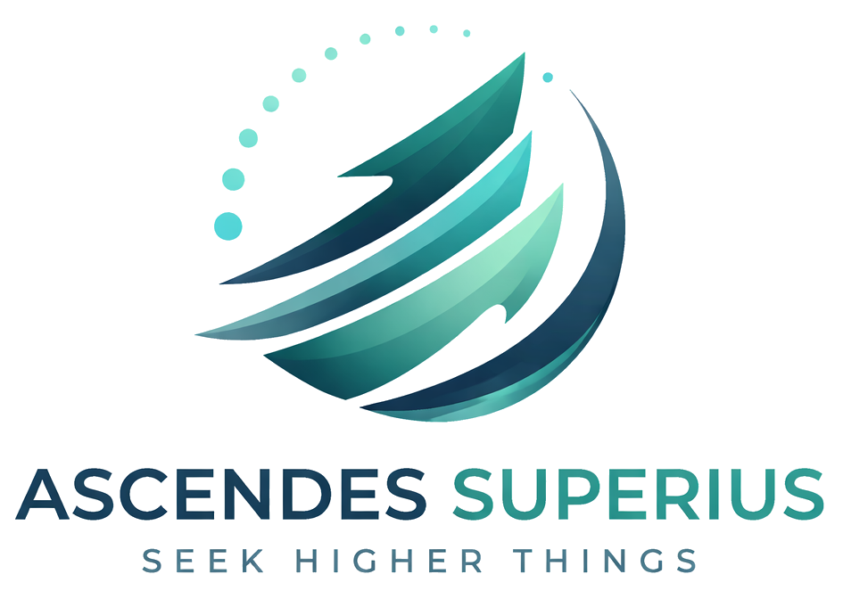

# Ascendes Superius – Brand Guidelines

## 1. Brand Overview
**Ascendes Superius** represents growth, elevation, and forward movement through intelligent systems, AI, and automation. The brand identity reflects clarity, precision, and modern futurism.

**Tagline:**  
*Seek Higher Things*

---

## 2. Logo System

### Primary Logo (Full Logo)

The full logo consists of:
- The **symbol (art mark)**
- The **brand name: "Ascendes Superius"**
- The **tagline: "Seek Higher Things"**

**Usage:**
- Official documents  
- Website headers  
- Presentations  
- Marketing materials  

---

### Secondary Logo (Symbol Only)

The standalone **art logo (symbol)** is the abstract upward-sweeping mark.

**Usage:**
- App icons  
- Favicons  
- Watermarks  
- Social media profile images  
- Minimal branding contexts  

---

### Logo Guidelines
- Maintain clear space around the logo at all times  
- Do not distort, stretch, or recolor outside the palette  
- Use full logo on light backgrounds for best readability  
- Use symbol-only version where space is limited  

---

## 3. Color Palette

### Primary Colors

| Color Name | Hex Code | Usage |
|------------|---------|------|
| Deep Teal | `#006D77` | Primary brand color, backgrounds, key elements |
| Soft Teal | `#83C5BE` | Secondary accents, UI highlights |
| Light Gray | `#EDF6F9` | Backgrounds, clean surfaces |

---

### Color Roles

**#006D77 (Deep Teal)**
- Core identity color  
- Represents strength, intelligence, and stability  
- Use for headings, primary buttons, and emphasis  

**#83C5BE (Soft Teal)**
- Supporting tone  
- Represents innovation and clarity  
- Use for highlights, hover states, and gradients  

**#EDF6F9 (Light Gray)**
- Neutral base  
- Represents simplicity and cleanliness  
- Use for backgrounds and spacing  

---

### Gradients
The brand supports smooth gradients between:
- `#006D77 → #83C5BE`

Used in:
- Logo mark  
- Hero sections  
- Visual transitions  

---

## 4. Typography

### Primary Style
- Clean, modern sans-serif  
- Bold for headings  
- Medium/Regular for body text  

### Tone
- Professional  
- Minimal  
- Futuristic  

---

## 5. Visual Identity

### Design Language
- Smooth curves and upward motion  
- Minimal clutter  
- Soft gradients  
- Balanced spacing  

### Symbol Meaning
The logo mark represents:
- Growth and ascension  
- Intelligent progression  
- Layered advancement (AI, automation, systems)  

---

## 6. Brand Voice

### Personality
- Intelligent  
- Forward-thinking  
- Precise  
- Confident  

### Messaging Style
- Clear and direct  
- Solution-oriented  
- Focused on innovation and efficiency  

---

## 7. Usage Principles

### Do
- Use consistent color palette  
- Maintain spacing and alignment  
- Apply gradients subtly  

### Don’t
- Use off-brand colors  
- Overcrowd designs  
- Alter logo proportions  

---

## 8. Summary

Ascendes Superius stands for elevation through technology.  
Every visual element should reinforce:
- Growth  
- Precision  
- Modern innovation  